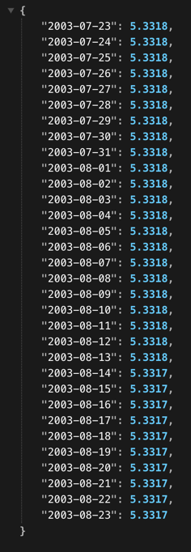
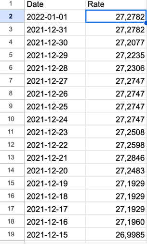

# ExchangeRate
**!IMPORTANT**

There is a basic authorization, so:
  login: admin
  pass: admin
# Source
The api uses the data from https://bank.gov.ua/NBU_Exchange/exchange_site
 
The code then was deployed to pythonanywhere

# Usage and Endpoints
## /exchange_rate {GET}
This will return the currency (<b> by default = $ </b>) exchange rates for a specified period (<b> by default = today </b>)
  An example url:  
https://frontfliip.pythonanywhere.com/exchange_rate?from=2003-07-23&to=2003-08-23
 
The params for period specification are **'to'** and **'from'** 
  The result of executing: 

The format of output is {"date": rate, ...}

## /write_exchange_rate {GET}
This endpoint is used to clear the spreadsheet and write new data to it. 
For example for the period from 2015-01-01 to 2022-01-01 the url will look the following way:  
https://frontfliip.pythonanywhere.com/write_exchange_rate?from=2015-01-01&to=2022-01-01  
Here is the link to the spreadsheet: 
https://docs.google.com/spreadsheets/d/157euJzp2TZ41NsQRkfv-UVDmOsn7XQESBczDx-u03gY/edit?usp=sharing

